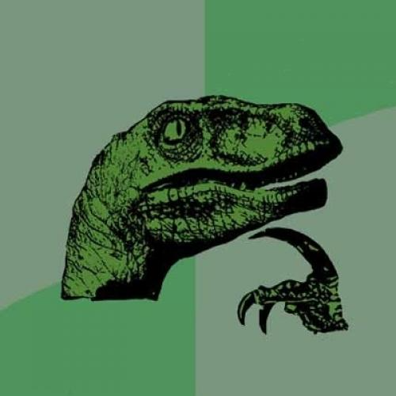

# Velojiraptor

Velojiraptor pulls and generates metrics from Jira. It can display filtered history and generate 
Time In Status and Lead Time reports.

> There are similar solutions out there. Why implement a custom one? 

Mainly, because of the time in status report. This report is available via Jira plugins. The plugins provide poor 
interfacing with other apps. Automation of this report wasn't possible with the existing plugins on the market. 

We did it for fun too. 🤓



# Install

There are various ways of installing Velojiraptor.

## Precompiled binaries

Precompiled binaries for release are available in the [Release section](https://github.com/project-a/velojiraptor/releases) 
of this repository. Using the latest release binary is the recommended way. 

## Building from source

To build Velojiraptor from source code, you only need [Go 1.17 or greater](https://golang.org/doc/install).

```bash
go install cmd/vjr/vjr.go
```

# Usage

Velojiraptor provides various commands. With the `-h` or `--help` flag every command's help can be displayed. Most 
commands support different output formats. This can be controlled with the `--format` flag. 

## Search

Before generating any report, we need to search Jira's API for tickets. We will use the `search` command's output to 
as input for reports. 

We use JQL to filter tickets. JQL gives us flexibility. We can filter boards, assignees, statuses, creators and a 
lot more.

Visit [Jira's official JQL Guide](https://www.atlassian.com/software/jira/guides/expand-jira/jql) to learn more. 

```bash
export JIRA_USERNAME=foo
export JIRA_PASSWORD=bar
export JIRA_URL=https://baz.atlassian.net

vjr search --jql "project IN (GH) AND 2022-01-02 < updated AND updated < 2022-01-15 AND statusCategory IN (Done)" > result.json 
```

## History

History lists changes made the given field, based on the search result above. This can be useful, if we want to check how
often the due date of was moved.

```bash
vjr history --input result.json --field status
```

## Time in status

This report shows how long a ticket was in a certain status. The numbers are based on the status history. We can exclude 
statuses by adding `-e` flags.

```bash
vjr time-in-status --input result.json -e TODO -e "In Progress"
```

## Lead time

Based on the time in status report, we can generate a lead time report. Notice, that the `-e` flag is also accepted 
here.

```bash
vjr lead-time --input result.json -e Foo
```

## Count 

The `count` command is similar to `search`, since we use a JQL to find tickets via Jira's API. The real difference is 
under the hood. It's optimized for returning the number of search results.

For example if we would like to search for open bugs, we would do the following:

```bash
export JIRA_USERNAME=foo
export JIRA_PASSWORD=bar
export JIRA_URL=https://baz.atlassian.net

vjr search count --jql "type = bug AND statusCategory NOT IN (Done)" 
```
